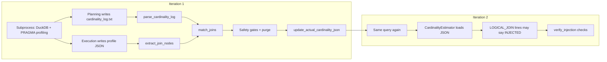

# End-to-end walkthrough: TPC-DS Q6 at scale factor 10

This document traces **one full feedback benchmark cycle** for a **real** query: **[TPC-DS Q6](https://www.tpc.org/tpcds/)** on **`tpcds_sf10.db`**. It follows data from the **first DuckDB subprocess run** through **optimizer estimates**, **JSON profiling**, **`match_joins`**, **`actual_cardinality.json`**, and a **second iteration** where the engine applies **injected** cardinalities.

For vocabulary and failure modes (ambiguous match, CTE duplicates, dynamic filters, etc.), see [`feedback_benchmark_injection.md`](feedback_benchmark_injection.md).

**Environment used when writing this note:**

- Database: `/Users/Aarry/Desktop/15689/tpcds_sf10.db`
- DuckDB binary: `build/release/duckdb` (repo root)
- Script: `feedback_benchmark.py` (same repo)

Cardinalities are **data-dependent**; if your SF10 database differs slightly, numbers may change but the **shape** of the pipeline stays the same.

---

## 1. The query (Q6)

Q6 is small enough to read in full and touches classic star-schema joins plus correlated subqueries:

```sql
SELECT a.ca_state state,
       count(*) cnt
FROM customer_address a ,
     customer c ,
     store_sales s ,
     date_dim d ,
     item i
WHERE a.ca_address_sk = c.c_current_addr_sk
  AND c.c_customer_sk = s.ss_customer_sk
  AND s.ss_sold_date_sk = d.d_date_sk
  AND s.ss_item_sk = i.i_item_sk
  AND d.d_month_seq =
    (SELECT DISTINCT (d_month_seq)
     FROM date_dim
     WHERE d_year = 2001
       AND d_moy = 1 )
  AND i.i_current_price > 1.2 *
    (SELECT avg(j.i_current_price)
     FROM item j
     WHERE j.i_category = i.i_category)
GROUP BY a.ca_state
HAVING count(*) >= 10
ORDER BY cnt NULLS FIRST,
         a.ca_state NULLS FIRST
LIMIT 100;
```

Your mental model: **five tables**, equality joins between them, plus **two scalar subqueries** that constrain `date_dim` and `item`. The **physical** plan will use hash joins (typically), while the **join-order optimizer** emits many **`LOGICAL_JOIN`** blocks into `cardinality_log.txt`—far more than “five joins,” because DP explores many subsets.

---

## 2. High-level pipeline



1. **`child_duckdb_env`** sets **`DUCKDB_ACTUAL_CARDINALITY_JSON`** and **`DUCKDB_CARDINALITY_LOG`** so the C++ estimator reads/writes the same paths as Python (`feedback_benchmark.py`).
2. **`run_query_with_json_profile`** wraps your SQL with **`PRAGMA enable_profiling = 'json'`** and runs **`duckdb /path/to/tpcds_sf10.db -c '…'`**. It can optionally set **`DUCKDB_FEEDBACK_PLAN_FINGERPRINT`** when called with a non-`None` fingerprint hint; **`run_single_query`** uses **`plan_fingerprint_hint=None`**, so the default benchmark loop does not namespace keys that way.
3. **`parse_cardinality_log`** turns each **`LOGICAL_JOIN`** record into a structured **`log_entries`** row (`expression`, `filters`, `tables`, `cardinality`, `is_injected`, …).
4. **`extract_join_nodes`** walks the profile tree and collects join operators (see **`JOIN_OPERATOR_NAMES`** in the script) with **`Conditions`**, **`Estimated Cardinality`**, measured cardinality, **`descendant_tables`**, **`subtree_operator_signatures`** (for the dynamic-filter guard), **`plan_path`**, and other fields used by matching and verification.
5. **`match_joins`** (built on **`precompute_join_match_caches`** + **`match_single_profile_join`**) pairs profile joins to log lines (predicates + table sets; **`used_log_indices`** prevents two physical joins from stealing the same log line).

**Scope:** The walkthrough below is one **`run_single_query`** call (one query number). The full benchmark’s **`main()`** also clears **`actual_cardinality.json`** and the log **after** each query finishes so the next query does not inherit another query’s keys.

## 3. What the first subprocess run does

### 3.1 SQL actually executed

Conceptually (see ```280:286:feedback_benchmark.py```):

```text
PRAGMA enable_profiling = 'json';
PRAGMA profiling_mode = 'detailed';
PRAGMA profiling_output = '<REPO_ROOT>/profile_output.json';
PRAGMA enable_progress_bar = false;
<your TPC-DS Q6 text>
```

The profiling output path is the constant **`PROFILE_OUTPUT`** (by default **`profile_output.json`** next to **`feedback_benchmark.py`** in the repo root).

- **Planning** appends to **`cardinality_log.txt`** (via **`DUCKDB_CARDINALITY_LOG`**).
- **Execution** writes a **JSON** profile, which Python loads and then **deletes** the file (transient profile on disk).

### 3.2 What shows up in `cardinality_log.txt`

After one cold run (empty **`actual_cardinality.json`**), the log contains blocks such as:

- A **`LOGICAL_JOIN:`** line with **`RelSets`**, **`Filters:`**, **`Estimated Cardinality:`**, optional **`CtxOcc:`**, etc.
- Often followed by **`SQL_COUNT_QUERY:`**, **`ESTIMATION_DETAIL:`**, and other diagnostics from this fork’s estimator.

For Q6 at SF10 on the setup above, **`parse_cardinality_log`** reported **48** such logical entries (many DP subsets explored—not “one line per SQL JOIN clause”).

### 3.3 What shows up in the JSON profile

`extract_join_nodes` walks the profile tree and reads **`operator_cardinality`** (and related **`extra_info`**) on each join-like operator (see ```375:432:feedback_benchmark.py```). For Q6 on this SF10 database, the eight tracked joins looked like this (abbreviated conditions):

| Operator | Condition (trimmed) | Est. rows | Actual rows |
|----------|---------------------|-----------|--------------|
| `LEFT_DELIM_JOIN` | `i_category IS NOT DISTINCT FROM i_category` | 0 | 0 |
| `HASH_JOIN` | `i_item_sk = ss_item_sk` | 30010 | 282158 |
| `HASH_JOIN` | `ca_address_sk = c_current_addr_sk` | 28260 | 282158 |
| `HASH_JOIN` | `c_customer_sk = ss_customer_sk` | 34409 | 282158 |
| **`HASH_JOIN`** | **`ss_sold_date_sk = d_date_sk`** | 34409 | **289017** |
| **`HASH_JOIN`** | **`d_month_seq = SUBQUERY`** | 87 | **31** |
| `HASH_JOIN` | `i_category IS NOT DISTINCT FROM i_category` | 0 | 282158 |
| `HASH_JOIN` | `i_category = i_category` | 13291 | 101768 |

Only the **two bold rows** were chosen for **`actual_cardinality.json`** on this run—the matcher tied **`HASH_JOIN`** predicates + descendant tables to distinct **`LOGICAL_JOIN`** lines and passed safety checks. Other joins stayed unmatched or failed pairing rules (§4.1).

---

## 4. Iteration 1 — match, inject, print `[NEW]`

When **`run_single_query(6, sql)`** ran on this machine:

- **8** physical join operators with usable metadata.
- **48** parsed log entries.
- **`match_joins`** produced **2** matches.

The script printed **new JSON entries** as **`[NEW] <full LOGICAL_JOIN line> -> <actual>`** (see **`update_actual_cardinality_json`**: the **`[NEW]`** line prints the raw **`expression`** string followed by **`->`** and the integer cardinality).

Those two correspond to:

1. **`store_sales ⋈ date_dim`** — **`Filters: [(ss_sold_date_sk = d_date_sk)]`** → actual **289017**.
2. **`date_dim ⋈ date_dim`** (month sequence vs subquery binding) — **`Filters: [(d_month_seq = SUBQUERY)]`** → actual **31**.

The **full line text** of each **`LOGICAL_JOIN`** becomes the **JSON key** (string-for-string match required by the C++ loader).

### 4.1 Why only two matches out of eight joins?

Rough categories for the **other six** physical joins (typical for Q6):

- **No compatible log line** after normalization / table-set checks (different subset than any explored **`LOGICAL_JOIN`**, or **`lineage_incomplete`** / subset logic doesn’t line up).
- **Predicate shape** in the profile doesn’t match any **`Filters:`** set in the log (correlated subquery, rewrites).
- **Ambiguity / unsafe** not triggered on this run for the remaining joins—they simply never became a winning **`best_lidx`** in **`match_joins`**.

So: **“unresolved” does not always mean a bug**; it often means the matcher’s conservative rules didn’t find a **unique, safe** logical counterpart.

### 4.2 What landed in `actual_cardinality.json`

After iteration 1, the file contained **two** entries: each **key** is the **entire** matched **`LOGICAL_JOIN:`** line; each **value** is the measured cardinality (stored as a number, here **289017** and **31** on this run).

Open **`actual_cardinality.json`** locally—the keys are long single-line strings, not short aliases.

---

## 5. Iteration 2 — injection shows up in the log

At the **start** of **`run_single_query`**, the benchmark **deletes** **`actual_cardinality.json`** and truncates **`cardinality_log.txt`** so each query begins with a clean slate. **Within** the per-query loop, **`clear_cardinality_log()`** runs again at the beginning of **each** iteration, while **`actual_cardinality.json`** is **not** cleared between iterations—it **accumulates** (after quarantine / CTE skips) so the next planning phase can load injections.

On the **second** planning pass for Q6, **`cardinality_estimator.cpp`** finds matching **`LOGICAL_JOIN`** expression strings in JSON and emits:

```text
LOGICAL_JOIN: … Filters: [(d_month_seq = SUBQUERY)] … using INJECTED Cardinality: 31.000000
LOGICAL_JOIN: … Filters: [(ss_sold_date_sk = d_date_sk)] … using INJECTED Cardinality: 289017.000000
```

So you can **grep** the fresh **`cardinality_log.txt`** for **`using INJECTED Cardinality`** to confirm the fork applied feedback.

**`n_injected`** in the result dict counts log lines marked injected on that iteration—for this Q6 run, **`n_injected`** was **2** at the end.

---

## 6. Verification (`verify_injection`)

Starting at iteration 2, **`verify_injection`** runs **`verify_check_1`** … **`verify_check_7`** (injected vs pre-update JSON, JSON keys present in the log, previously known matches showing **`INJECTED`**, injected vs measured profile cardinalities, distinct **`log_index`** bindings / duplicate-expression commentary, join coverage, and **ambiguous-candidate** reporting).

On this Q6 run, the printed checks **passed** (aside from any informational **`[INFO]`** lines), and the **plan structure text** matched between iterations with no pending JSON updates (`changes_made=False`) → **converged** in **2** iterations.

**Note:** **`run_single_query`** always prints **`Verification passed.`** after **`verify_injection`** returns, even when individual checks emitted **`WARN`** lines—read the **`[VERIFY]`** block above that line for the real status.

---

## 7. Contrast: a “simpler” query where injection may still be zero — Q3

**TPC-DS Q3** has fewer tables in the FROM clause, but on the same SF10 setup **`run_single_query(3, …)`** ended with **`n_injected: 0`**:

- **`match_joins`** found **one** candidate that matched **`store_sales ⋈ item`**, but the **dynamic-filter guard** fired: **`ss_sold_date_sk`** appeared as a **dynamic filter** column under the subtree **without** being listed in the join’s **condition** string alone → **`[ALARM-DYNAMIC-FILTER-CONTEXT]`** → **`[SKIP-UNSAFE]`**.
- Another physical join stayed **`unresolved`** (no acceptable **`pnorm`** / log pairing).

So **“simple SQL” ≠ “simple feedback.”** Parallel pipelines and dynamic filters can block injection even when estimates exist in the log.

---

## 8. Files and knobs to replay

```bash
cd /path/to/duckdb15689
export DUCKDB_FEEDBACK_DB=/path/to/tpcds_sf10.db
export DUCKDB_FEEDBACK_SF=10
# Optional: subprocess timeout for each profile run (seconds)
# export DUCKDB_BENCHMARK_MAIN_QUERY_TIMEOUT_SEC=600

# Optional: only Q6 via a tiny driver
python3 -c "
import feedback_benchmark as fb
fb.clear_actual_cardinality_json()
fb.clear_cardinality_log()
q = fb.load_tpcds_queries([6])
print(fb.run_single_query(6, q[6]))
"
```

Inspect:

- **`cardinality_log.txt`** — planning narrative + **`INJECTED`** lines on later iterations.
- **`actual_cardinality.json`** — injected keys and doubles (written by Python; read by C++).
- Console — **`[NEW]`**, **`[SKIP-UNSAFE]`**, **`[MATCH WARN]`**, **`[VERIFY]`** lines.

---

## 9. Takeaways

| Topic | Q6 example |
|--------|------------|
| **Many log lines, few matches** | 48 logical estimates vs 8 physical joins vs **2** safe matches. |
| **Injection key** | The entire **`LOGICAL_JOIN:`** line text — not a short alias. |
| **Success signal** | **`using INJECTED Cardinality`** in **`cardinality_log.txt`** and **`[VERIFY] Check 3`** passing. |
| **Convergence** | Same **plan structure text** on successive iterations AND **no JSON updates pending** (`changes_made=False`), **or** the loop stops early on **plan oscillation**. |
| **Not every query injects** | Q3 can finish with **0** injections despite a smaller-looking SQL text. |

---

*Generated from `feedback_benchmark.py` behavior and an actual SF10 run; re-run commands if you change matcher logic or estimator logging.*
